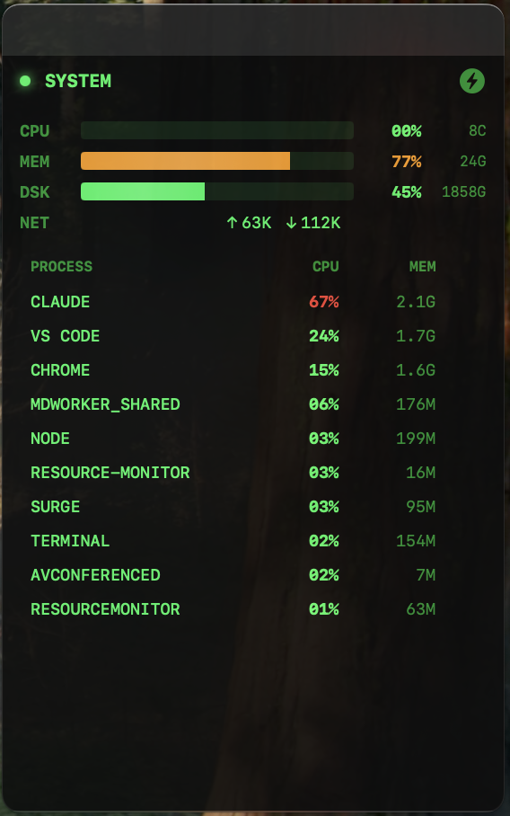

# macOS Resource Monitor

A desktop widget for real-time macOS system monitoring with Matrix-style UI.



## Features

- **Real-time Monitoring**: CPU, Memory, Disk, Network usage
- **Process Management**: Top 10 processes with one-click kill
- **Matrix Style UI**: Hacker-themed dark interface with green accents
- **Desktop Widget**: Sits at desktop level, behind other windows
- **Auto-start**: Launches automatically on boot
- **Draggable**: Move the widget anywhere on screen

## Installation

### Download PKG (Recommended)

1. Download `ResourceMonitor-1.0.0.pkg` from [Releases](https://github.com/frankie0736/macos-resource-monitor/releases)
2. Double-click to install (requires admin password)
3. App starts automatically after installation

### Build from Source

```bash
# Requirements: Xcode, Go 1.21+

# Clone
git clone https://github.com/frankie0736/macos-resource-monitor.git
cd macos-resource-monitor

# Build PKG installer
make pkg

# Install
sudo installer -pkg ResourceMonitor-1.0.0.pkg -target /
```

## Architecture

```
┌─────────────────────┐     HTTP :19527     ┌─────────────────────┐
│   Swift UI Frontend │ ◄─────────────────► │    Go Backend       │
│   (Desktop Widget)  │                     │   (System Monitor)  │
└─────────────────────┘                     └─────────────────────┘
```

## Tech Stack

- **Backend**: Go + [gopsutil](https://github.com/shirou/gopsutil)
- **Frontend**: Swift + SwiftUI + AppKit
- **IPC**: HTTP REST API on localhost

## Requirements

- macOS 12.0+
- Apple Silicon or Intel Mac

## Uninstall

```bash
make uninstall
```

Or manually:

```bash
sudo rm -rf /Applications/ResourceMonitor.app
sudo rm -f /usr/local/bin/resource-monitor
rm -f ~/Library/LaunchAgents/com.fx.resource-monitor.plist
launchctl unload ~/Library/LaunchAgents/com.fx.resource-monitor.plist
```

## License

MIT
